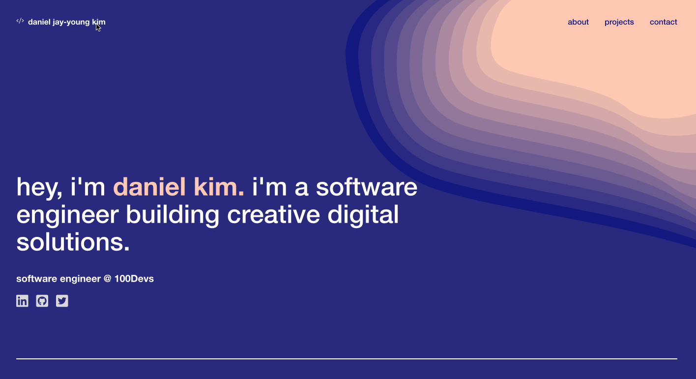

  <h3 align="center">My Professional Portfolio</h3>

  

    A React.js App!
     
    <a href="https://github.com/danjkim21/portfolio-daniel-kim"><strong>Explore the docs »</strong></a>
     
     
    <a href="https://daniel-jkim.com/">View Live App</a>
    ·
    <a href="https://github.com/danjkim21/portfolio-daniel-kim/issues">Report Bug</a>
    ·
    <a href="https://github.com/danjkim21/portfolio-daniel-kim/issues">Request Feature</a>
  

## About The Project

I recently built my new portfolio using React. I wanted to turn my old portfolio into a minimal design, funky color scheme and fun animations to reflect my personality and approach to web design.

  

## How It's Made

**Tech used:** React, Vite, HTML, CSS  

## Roadmap

- [ ] Refactor, refactor, refactor, & refactor

See the [open issues](https://github.com/danjkim21/portfolio-daniel-kim/issues) for a full list of proposed features (and known issues).

## Contributing

If you have a suggestion that would make this better, please fork the repo and create a pull request. You can also simply open an issue with the tag "enhancement".
Don't forget to give the project a star! Thanks again!

1. Fork the Project
2. Create your Feature Branch (`git checkout -b feature/AmazingFeature`)
3. Commit your Changes (`git commit -m 'Add some AmazingFeature'`)
4. Push to the Branch (`git push origin feature/AmazingFeature`)
5. Open a Pull Request

## License

Distributed under the MIT License. See `LICENSE.txt` for more information.

## Contact

Daniel Kim - [@devdanielk](https://twitter.com/devdanielk) - dan.jkim21@gmail.com

Project Link: [https://github.com/danjkim21/portfolio-daniel-kim](https://github.com/danjkim21/portfolio-daniel-kim)
 
Github Live Page: [https://daniel-jkim.com/](https://daniel-jkim.com/)
